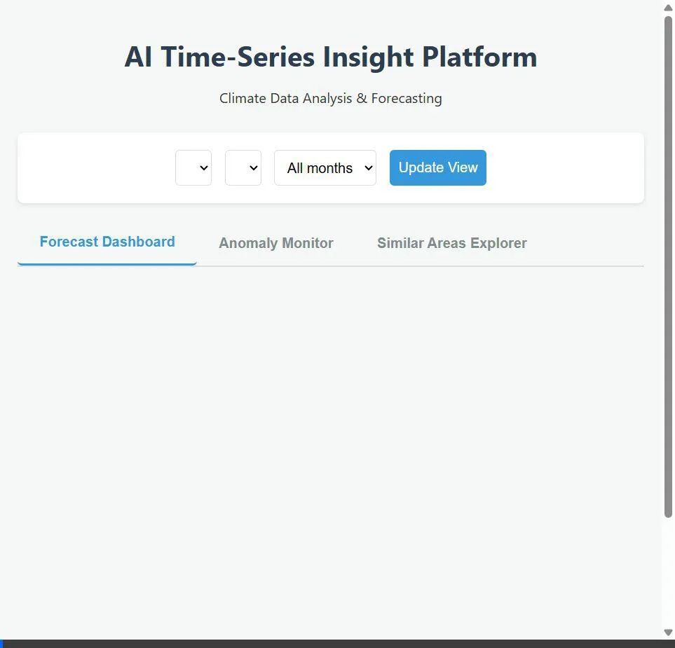
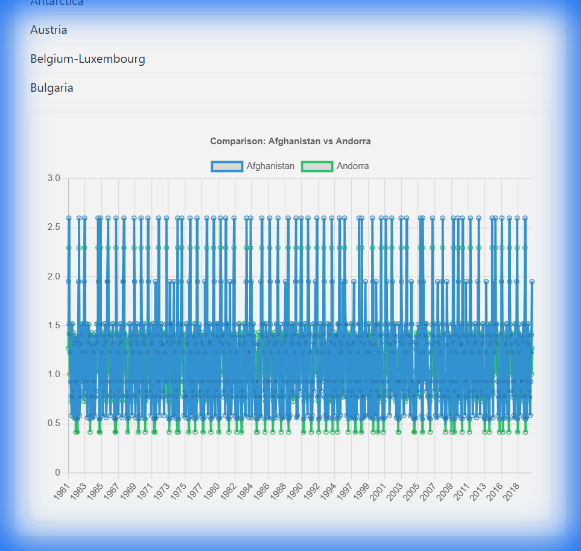

# AI Time-Series Insight Platform 🌍📈

> **A robust, AI-powered web application for analyzing climate data, forecasting temperature trends, and detecting anomalies.**


## 📖 Overview

The **AI Time-Series Insight Platform** is designed to provide deep insights into environmental temperature changes. By leveraging machine learning (Random Forest & KMeans Clustering), the application offers predictive capabilities and anomaly detection to help researchers and analysts understand climate patterns.

This project features a **decoupled architecture**:
- **Frontend**: A standalone, responsive HTML/CSS/JS interface.
- **Backend**: A Python Flask API handling data processing and ML inference.

## ✨ Key Features

### 1. 🔮 Forecast Dashboard
- **10-Year Predictions**: Visualizes historical data alongside a 10-year future forecast using a trained Random Forest Regressor.
- **Trend Analysis**: Automatically calculates and displays the 10-year trend and expected values for the upcoming year.
- **Dynamic Filtering**: Filter data by **Area**, **Element** (e.g., Temperature Change), and **Month**.

### 2. 🚨 Anomaly Monitor
- **Smart Detection**: Identifies significant deviations (anomalies) in temperature data where actual values differ from predicted baselines by more than 2 standard deviations.
- **Visual Alerts**: Highlights anomalies in red on interactive charts.
- **Detailed Logs**: Provides a list view of specific years and months where anomalies occurred.

### 3. 🗺️ Similar Areas Explorer
- **Clustering Engine**: Uses KMeans clustering to group geographical areas with similar climate characteristics (Mean, Std Dev, Min, Max).
- **Comparative Analysis**: Instantly finds and visualizes the top 5 areas most similar to your selected region.

## 🎥 Demo & Screenshots

### Full Application Demo


### Dashboard Screenshot


---

## 🛠️ Technology Stack

- **Backend**: Python 3.x, Flask, Flask-CORS
- **Data & AI**: Pandas, Scikit-Learn, NumPy, Joblib
- **Frontend**: HTML5, CSS3 (Custom Premium Design), JavaScript (ES6+)
- **Visualization**: Chart.js

---

## 🚀 Getting Started

Follow these instructions to set up and run the project on your local machine.

### Prerequisites
- Python 3.8 or higher installed.
- `pip` (Python package manager).

### 📥 Installation

1.  **Clone or Download** this repository.
2.  **Navigate** to the project directory in your terminal:
    ```bash
    cd "path/to/project/archive"
    ```
3.  **Install Dependencies**:
    ```bash
    pip install flask flask-cors pandas scikit-learn joblib
    ```

### ▶️ How to Run

#### Step 1: Train the Model 🧠
*You only need to do this once (or whenever the dataset changes).*
```bash
python train_model.py
```
> **Output**: This will generate `model_pipeline.pkl` and `area_clusters.csv`.

#### Step 2: Start the Backend Server ⚙️
```bash
python app.py
```
> **Success**: You should see `Running on http://127.0.0.1:5000`. Keep this terminal window **OPEN**.

#### Step 3: Launch the Application 🖥️
1.  Go to the project folder in your **File Explorer**.
2.  Double-click **`index.html`**.
3.  The application will open in your default web browser.

---

## 📂 Project Structure

```
├── app.py                 # 🐍 Flask API Server (Backend)
├── train_model.py         # 🤖 ML Training Script
├── index.html             # 🌐 Main Entry Point (Frontend)
├── css/
│   └── style.css          # 🎨 Application Styling
├── js/
│   └── main.js            # ⚡ Frontend Logic & API Integration
├── processed_long_dataset.csv  # 📊 Source Data
├── model_pipeline.pkl     # 📦 Trained Model Artifact (Generated)
└── area_clusters.csv      # 📦 Clustering Artifact (Generated)
```

## 🤝 Contributing
Contributions, issues, and feature requests are welcome! Feel free to check the � https://github.com/PranayPinjarkar.

## 📝 License
This project is open-source and available under the [MIT License](LICENSE).
